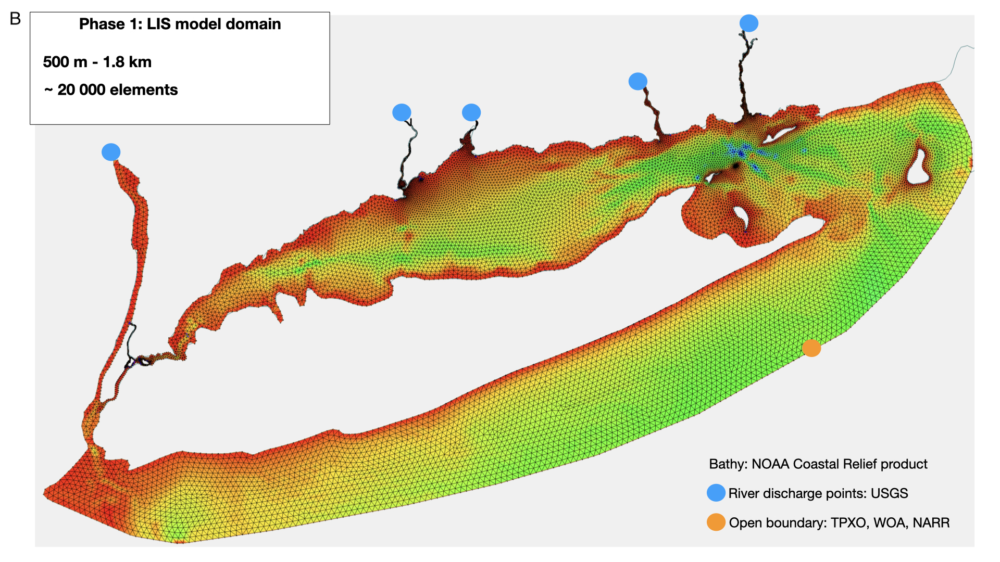

## About this Repository

This repository provides a step-by-step guide on how to setup and run FVCOM successfully on the HPL server, or any other server for that matter. 

## About the model domain
Our small scale implementation of FVCOM utilizes 10 sigma layers in the vertical domain, with 14,169 elements and 7,430 nodes in a meso-haline segment of the second major river channel leading into the estuary, the Housatonic River. The model resolution increases from ~700 m in the main stem of Long Island Sound to ~30 m in the marsh region (Figure 1a). The main goal of this project is to implement this FVCOM model across the entire Long Island Sound estuary, including its tidal marshes. Specifically focusing on assessing changes in estuarine water quality, organic matter cycling. We are currently in phase 1 of seting up the Long Island Sound model (figure 1b).

## Information about the data used to force the open and river boundaries for both the Housatonic and Long Island Sound Models

## River Boundary Forcing

- The Thames and Connecticut Rivers make up 80% of the freshwater inflow into the sound. With the Connecticut contributing 72%,
the largest freshwater input source

These are the princple rivers flowing into the LIS

1. Hudson River 
2. Housatonic River (combines Naugatuck and Housatonic Rivers)
3. Quinnipiac River
4. Connecticut River
5. Thames River (combines Quinebaug, the Shetucket, and the Yantic Rivers)

USGS gauge stations used

1. Hudson @ Green Island, Troy Dam -- 01358000 (discharge); 01359139 (daily mean temperature 2014-2016)
2. Naugatuck @ Beacon Falls -- 01208500 (discharge), Housatonic @ Stevenson -- 01205500 (discharge), Milford -- 01200600 (temperature)
3. Quinnipiac River @ Wallingford -- 01196500 (discharge and temperature)
4. Connecticut @ Thompsonville -- 01127500 (discharge and temperature)
5. Yantic River @ Yantic -- 01127500 (discharge, Quinebaug River at Jewett City -- 01127000 (discharge), Shetucket River near Willimantic -- 01122500 (discharge)

For the Housatonic Model domain a sum of the freshwater discharge was obtained by combining the Naugatuck and the Housatonic Rivers. 
This was done because there is no gauge station near the head of the Housatonic River, and thus unsure of what that flow might be. 
Connecticut will be used for the Thames, assuming that the systems share similar charactertistics since they are closer to the MAB.

In terms of the LIS Model, the same will be done. All rivers are forced at the head of the river where there is no tidal influence. Since we are unsure of the exchange with the East River on the western part of the sound, the Hudson is included as a river (FVCOM computes the exchange anyway so we can validate model with 
Gay et al. 2004). All the other smaller non-point source rivers will be delt with as a shoreline, since its contribution to the freshwater flux into the sound is very small (insignificant). 

## Open Boundary

- For the Housatonic Model a monthly average of temperature, salinity was derived from 9 CT DEEP stations (LISICOS) in the sound,
this is because the WOA (World Ocean Atlas) data would overestimated temperature and salinity (create bias)
- For the LIS Model the WOA model was used to obtain temperature and salinity. Tides m2 (TPXOv9 model). Weather from NARR (3hr composites)

## Running FVCOM on Cbeps3

**...connecting to cbeps3**

> ssh lziegler@10.1.14.19 then
> enter password

**...Setup directory environment from cbeps servers**

1. Copy and unzip *INSTALL_modules* and *FVCOM2.7_source* folders on cbeps

2. In the *FVCOM2.7_source* locate the **makefile** and open it

> username$ vi makefile

4. Change the following paths in your **makefile** to point to where modules in *INSTALL_modules* are located in your directory:

 - Flag 4: PARLIB = -L/data/users/lziegler/software/METIS_source -lmetis
 - Flag 6: IOLIBS =  -L/data/users/lziegler/netcdf-3.6.1-intel/lib  -lnetcdf
 - Flag 6: IOINCS =  -I/data/users/lziegler/netcdf-3.6.1-intel/include

... compile the makefile by typing **make** in the command line

> lziegler$ **make**

- *...note: you only need to do this once*

3. Create your main working directory- *this directory will contain the following folders:*

| Main working Directory | Description |
|------------------------|-------------|
|Inputs                  | contains all forcing files|
|Output                  | this folder will be empty initially, but contains all model outputs|
|netcdf                  | this folder is created in the Output folder and contains all netcdf model output|
|executable file         | run.dat file is the executable file|

## Setup your run.dat file (executable file)

This is called lziegler/tonic/**tonic.dat** in lziegler cbeps account

This file allows you to change the time period the model runs for. 

- *...note: the model is run in days per second*

- *...note: the name you choose to call this file is used at the end of the executable command line when running the model*

## Finally run the model

..Yay you are ready to run!

*The following command is used to excute the model:*

> lziegler$ mpiexec -n 36 ../FVCOM-2_7-model/chesroms_HFX **runfile name**

...Example:
> lziegler$ mpiexec -n 36 ../FVCOM-2_7-model/chesroms_HFX **tonic**

...to check that the model is running use **tail -f** or **top**

  > lziegler$ **tail -f myrun.log** or **top**
  > to exit press **ctrl c**

