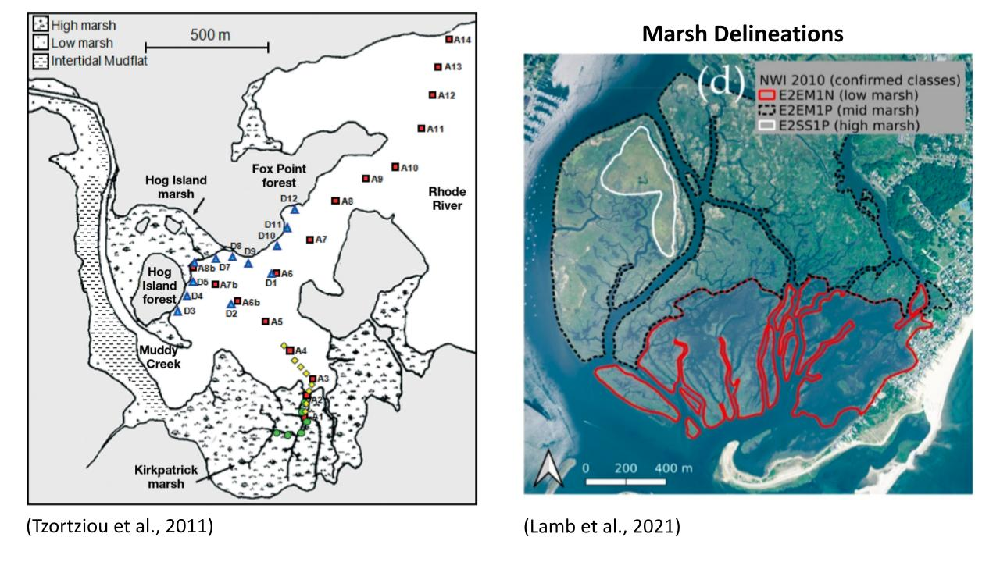
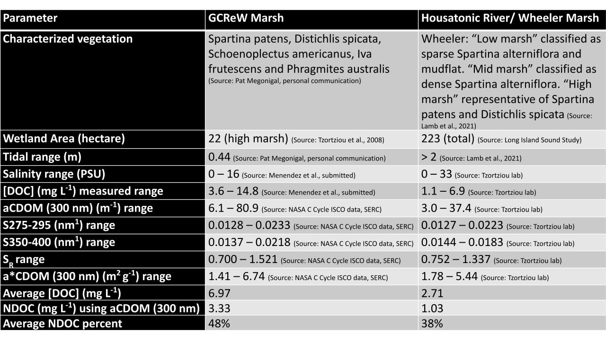

## About This Repository

This repository provides a step-by-step guide on how to setup and run ICM successfully on the HPL server, or any other server for that matter. 

This is PART 2, modeling the biogeochemistry. Here you will be using the physics model outputs generated from FVCOM to drive the biogeochemical model. The Rhode River ICM model is taken and applied as is to the Housatonic River model-- with changes made to the forcing files used. Parameters have stayed the same as there was no significant evidence to suggest otherwise (assuming both systems are the same, not much variability in NH4 uptake and total amount of DOM exported from the marsh). Based on GCrew marsh results in the Chesapeake Bay vs the Wheeler Marsh in the Housatonic River, CT (see reference table by A. Menendez)

## Information About the Data Used to Force the Open and River Boundaries for Both the Housatonic Model

## River Boundary 
*creating these forcings refer to **CreatingINPUTS_readme.md** for more detail*

***USGS gauge stations used***  
|Station name                       | Station number | variable used                   |
|-----------------------------------|----------------|---------------------------------|
|1. Naugatuck @ Beacon Falls        | 01208500       | discharge & water quality variables|
|2. Housatonic @ Stevenson          | 01205500       | discharge                       |
|3. Milford                         | 01200600       | temperature                     | 
|4. Naugatuck @ Ansonia             | 01208736       | water quality variables         |

Due to sparse data for biogeochemical variables, some variable patterns are constant. For the river boundary chlorophyll variable for example, a constant value had to be given a constant value during spring where no data was collected, but that still represented the expected seasonal pattern. This was done so that the model would at least be forced with cholorophyll at the start, no input would cause incorrect results. 

## Open Boundary
*creating these forcings refer to **CreatingINPUTS_readme.md** for more detail*

- For the Housatonic Model a monthly average of water quality variables were derived from CT DEEP station (LISICOS) station 4, in the sound. Station H4 was the only station used as it was best data set within the boundary region
 therefore all obc nodes will have the same forcing. 

## Running FVCOM on Cbeps3

### ...Connecting to the HPL-Cbeps3 Server 

> ssh username@10.1.14.19 **then**
> enter password

### ...Setting Up Your Main Working Directory Environment  

1. Copy and unzip *INSTALL_modules* and *wqmsrc_fvcom2.7* folders on cbeps

2. In the *wqmsrc_fvcom2.7e* folder locate the **makefile** and open it

> username@cthulu$ **vi makefile**

3. Change the following paths in your **makefile** to point to where modules in *INSTALL_modules* are located in your directory:

 - Flag 1: PARLIB = -L/data/users/lziegler/software/METIS_source -lmetis
 - Flag 2: IOLIBS =  -L/data/users/lziegler/netcdf-3.6.1-intel/lib  -lnetcdf
 - Flag 2: IOINCS =  -I/data/users/lziegler/netcdf-3.6.1-intel/include

... compile the makefile by typing **make** in the command line

> username@cthulu$ **make**

- *...note: you only need to do this once, unless you make changes to the fortran code*

4. Create your main working directory 

***this directory will contain the following folders:***
| Main working Directory | Description |
|------------------------|-------------|
|Inputs                  | contains all forcing files|
|Output                  | this folder will be empty initially, but contains all model outputs|
|netcdf                  | this folder is created in the Output folder and contains all netcdf model output|
|netcdf_check.dat        | shows you variable output information and .nc files that have been completed so far|
|tonic_netcdf.dat        | specify variables controlling netcdf output: can change the output time and variables to be printed in the netdfc file|
|wqm_con.npt| control file for the ICM water quality model|
|wqm_linkage.in | where you specify the path to the fvcom model netcdf files that will used to force the physics of the ICM model|

### Setup Your *wqm_con.npt* File (control file)

*The only things you need to worry about changing are the following:*
>1. Grid information (# of nodes etc.) --> highlighted with a blue box
>2. Internal model timestep --> highlighted with a blue box
>3. Paths that point to the inputs and outputs folders --> highlighted with a blue box
 

- *...note: the model currently runs with a timestep of 120sec-- timestep at which model does not crash.*

### Finally Run the Model

... running ICM is the same as FVCOM

*The following command is used to excute the model:*
> username@cthulu$ mpiexec -n 36 ../wqmsrc_fvcom2.7/wqm_dom_NCDF **runfile name** 

*...Example:*
> lziegler@cthulu$ mpiexec -n 36 ../wqmsrc_fvcom2.7/wqm_dom_NCDF **tonic** 2>&1>myrun.log& [add at end if you want to create a log file]

...to check that the model is running use **tail -f** or **top**
*...Example:*
  > username@cthulu$ **tail -f myrun.log** or **top**
  > username@cthulu$ **ctrl c** (to quit the log screen) 

