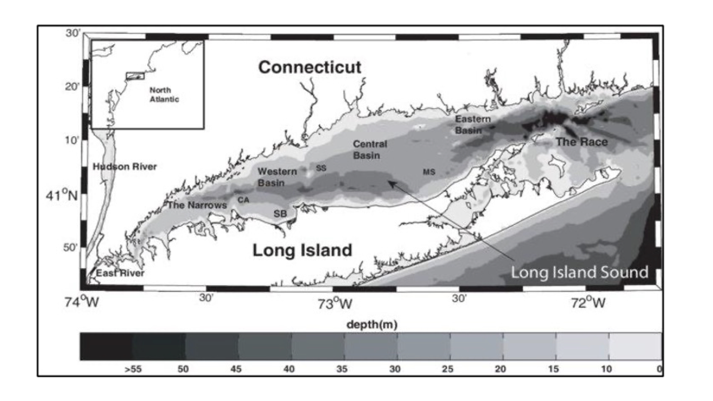
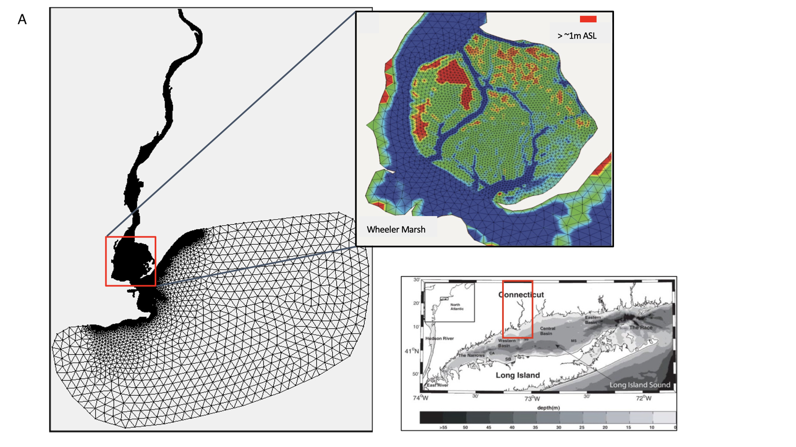
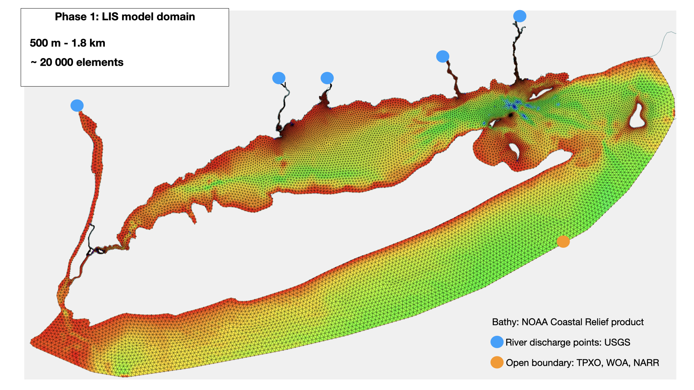

## Implementing FVCOM in a Coastal Wetland-Estuarine Interface

The physical transport of water, salinity, and temperature in ICM are driven by the hydrodynamic model, FVCOM (Chen et al., 2003; Kim & Khangaonkar, 2012). FVCOM utilizes a terrain following unstructured grid, making it ideally suited for complex coastal bathymetry. In addition, the wetting and drying treatment within FVCOM makes it well suited for applications in the intertidal range (Chen et al., 2008). ICM was coupled to FVCOM for research in the Salish Sea (Khangaonkar et al., 2017; Kim & Khangaonkar, 2012). We have adapted the same modeling system used for work in Chesapeake Bay, MD, USA (Clark et al., 2020) and applied it to Long Island Sound estuary and its major freshwater tributaries (Figure 1a). 

[put code to display figure here...]

Our scale implementation of FVCOM utilizes 10 sigma layers in the vertical domain, with 14,169 elements and 7,430 nodes in a meso-haline segment of the second major river channel leading into the estuary, the Housatonic River. The model resolution increases from ~700 m in the main stem of Long Island Sound to ~30 m in the marsh region (figure 2).

The main goal of this project is to implement this FVCOM model across the entire Long Island Sound estuary, including its tidal marshes. Specifically focusing on assessing changes in estuarine water quality, organic matter cycling. We are currently in phase 1 of seting up the LongIsland Sound model (figure 3).

------------------------------------------------------------------------------------------
## About FVCOM-ICM modeling tool

ICM is offline coupled to FVCOM in a system called the Unstructured Biogeochemical Model (Kim & Khangaonkar, 2012). The physical variables relating to water advection, diffusion, temperature, and salinity are first calculated independently of the biogeochemistry. Once a satisfactory hydrodynamic model solution is attained, the solution is stored and then used to drive the biogeochemical kinetic formulations within ICM. Details of all the formulations related to reaction kinetics for each of the ICM water column biogeochemical constituents (following Cerco & Noel, 2017), including organic carbon, organic nitrogen, inorganic nitrogen, underwater (UV) ultraviolet and visible light, phytoplankton, and dissolved oxygen are referenced in the Supplementary information by Clark et al., 2020 [insert citation to paper and supplementary information]. Model parameters are based on the Rhode River model and adapted where necessary for the Housatonic River system (refer to Clark et al., 2020 for detailed description of model paramters and setup).

The model allows exploration of the role tidal marshes play in estuary carbon and nitrogen cycling by simulating physical and biogeochemical processes at a high spatial and temporal resolution. By numerically removing the tidal marsh from the model, a direct estimate is made of the total DOC that can be attributed to the presence of the tidal marsh. This has implications for how much DOC in estuarine organic carbon budgets can be considered of tidal marsh origin. It should be noted that the marsh area itself does not contain a dynamic plant community and the associated biogeochemical effects. The lack of dynamic plant growth and senescence means that the TOC budget within the marsh cannot be estimated; the marsh acts more as a source or sink for organic matter rather than a dynamic part of the ecosystem.  

## About this Repository
This repository is structured in such a way that anyone who wants to use this tool can easily setup, execute and run FVCOM-ICM models in any coastal system. Each folder will contain a README.md, which will provide more detail. 

Main working folders
| Name | Description |
|------|-------------|
| FVCOM2.7| includes: sourcecode, executable folder (inputs and run.dat executable file)|
| ICM  | includes: sourcecode, executable folder (inputs and run.dat executable file)|
| Toolbox| contains matlab scripts used to make model forcing files and plot model output|
| INSTALL_modules| these modules need to be installed before running both models. The sourcecode calles on these libraries during model computation|

## **Steps to Running FVCOM on a Unix Server**

**...connecting to cbeps3**

ssh username@10.1.14.19
enter password

Setup directory environment from cbeps servers

Libraries required:
1. netcdf-3.6
## Create forcing files

Create your **makefile**

## Finally run the model

Before excuting the model, first locate the **makefile** in the FVCOM-2_7-model folder. Run that file.  

1. Create a screen so that you can run the model in the background and still be able to carry on with other things in the terminal.  
    - lziegler$ **screen -r**
    - to exit or detach screen **ctrl a+d**
2. If you dont want to set up a screen, another way to check if your model is still running is:  
    - lziegler$ **tail -f myrun.log** or **top**
    - to exit press **ctrl c**

The following command is used to excute the model

$ mpiexec -n 36 ../FVCOM-2_7-model/chesroms_HFX <file name>

